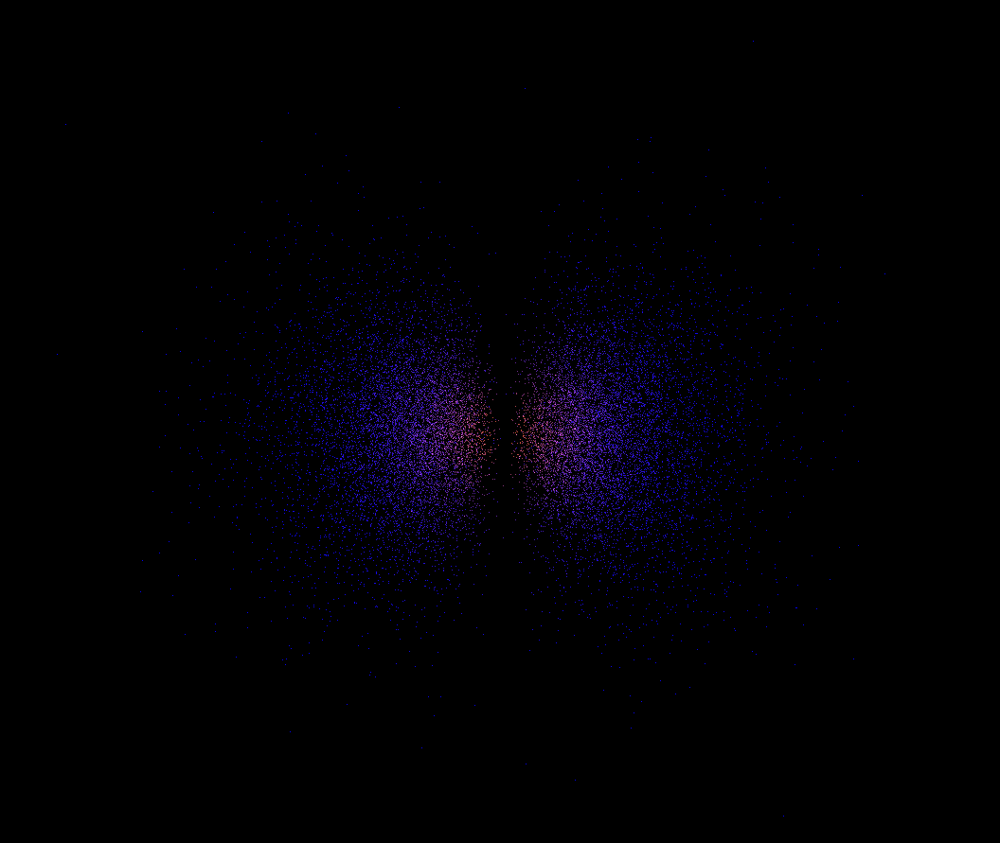
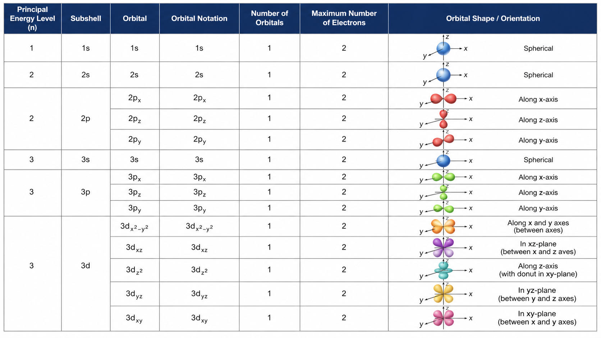

# Quantum-Atom

Visualization of atomic orbitals based on solutions of the Schrödinger equation. This project render a 3D point cloud where the density of points represents the probability of finding an electron around a nucleus.

## Overview

The program uses analytical solutions of the Schrödinger equuation for hydrogen-like atoms to generate probability distributions. Points are sampled in space and displayed using OpenGL and GLFW to form a visual representation of atomic orbitals.

## Features

3D visualization of electron probability density, basic controls

Point cloud rendering    

Basic camera movement    

Different orbitals (depending on implementation)    

## Controls

Pressing 1 will display 1s.

Pressing 2 will display 2s. Once 2s is diplayed, pressing p will display 2p and once 2p is displayed, pressing x,z or y will display the following subshells. It applies to 3s and 3p.

If 3s or 3p is displayed, use the left arrow in order to display 3d subshells (when they will be implemented).

You can only move forward or back with the arrows, and move up or down with the space bar or left shift.

Note that the currently displayed is chlorine due to his large amount of electron shells.

## How it works

The probability is derived from the wave function psi obtained by solving the Schrödinger equation. Points are generated in 3D space and kept or rejected based on the probability density function. Higher density regions correspond to higher probability of electron presence.

## Physics Background

This project visualizes atomic orbitals using solution of the Schrödinger equation for hydrogen-like atoms (1 electron). The hydrogen atom serves as a basic model: above 1 electron, the equation becomes impossible to solve analytically.

### Schrödinger Equation

The time-independent Schrödinger equation is:

$$\Psi(r, \theta, \phi)$$ = solution of:
$$\hat{H}\Psi = E\Psi$$

where $\hat{H}$ is the Hamiltonian operator and $\Psi$ is the wave function of the electron.

### Hydrogen-like Atom

For a hydrogen atom (or hydrogen-like ions), the equation can be solved analytically. The solutions are expressed in spherical coordinates and depend on three quantum number: $(n, l, m)$. (principal quantum number, azimuthal quantum number and magnetic quantum number).
Spherical coordinates are an alternative to cartesian coordinates $(x, y, z)$. A point is defined by $(r, \theta, \phi)$:

$$r$$: the distance between the point and the origin of the coordinate system  
$$\theta$$: the angle between the $z$ axe and the line linking the origin to the point  
$$\phi$$: rotation angle around the $z$ axe  
 
These coordinates simplifie calculation when the problem got a spheric symmetry (orbitals).
The wave function can be written as:

$$\Psi_{nlm}(r, \theta, \phi) = R_{nl}(r) \cdot Y_{lm}(\theta, \phi)$$

where:

$$R_{nl}(r)$$ is the radial part  
$$Y_{lm}(\theta, \phi)$$ are the spherical harmonics.

### Probability Density  

The probability of finding the electron at a given position is:

$$P(r, \theta, \phi) = |\Psi_{nlm}(r, \theta, \phi)|^2$$ 

This quantity is what is visualized in the program

### Visualization Method

To represent this probability density:  

    Points are randomly generated in 3d space  

    The probability density $P$ is evalued at each point  

    Points are accepted with a probability proportional to $P$  

    The resulting point approximates the electron distribution  

## Limitations

Simplified model (hydrogen-like atoms) 

Electron interactions are not included  

No advanced optimization  

Basic rendering pipeline  

## Future improvements

Better rendering (shaders, lighting)  

Interactive atom & orbital selection  

Performance improvements  

Better camera

GUI controls  